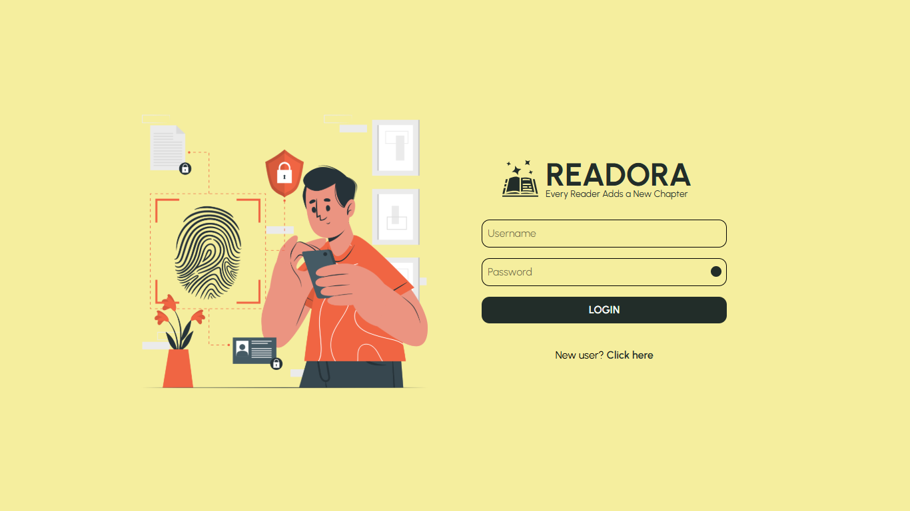
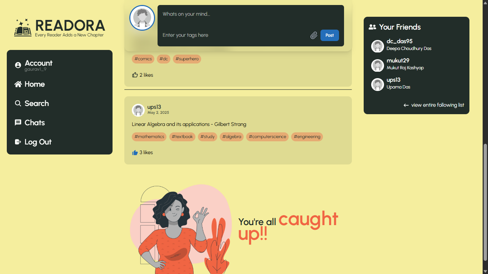
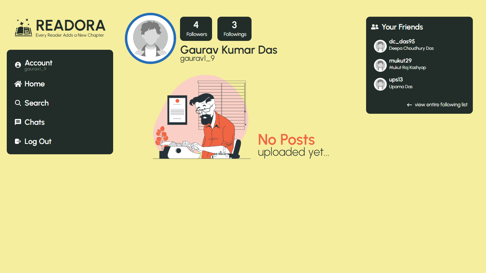
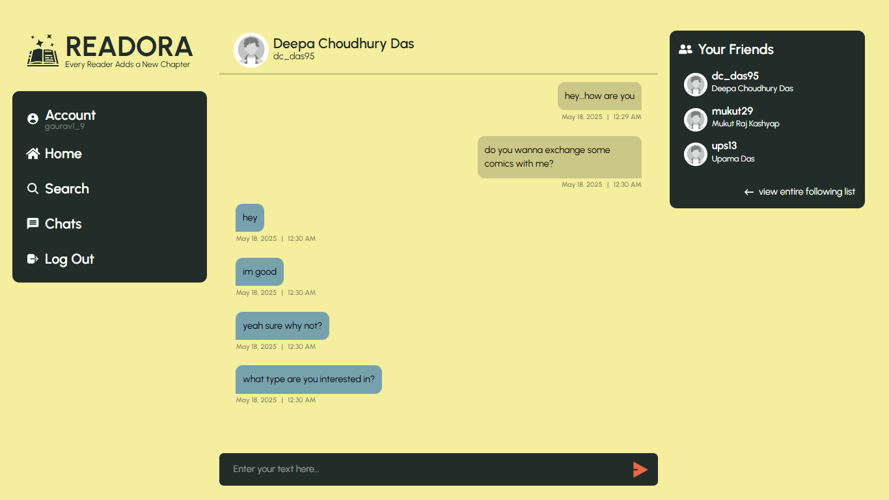

# READORA - A book exchange social media platform

A MERN stack social media application where users within a college campus can connect and exchange books. Users can post books they want to give away or request, chat with others, and arrange offline exchanges.

## Project Screenshots






## Features
- User authentication and registration
- Post books for exchange
- Chatting (real-time feature coming soon)
- Search for users

## Technologies Used
- MongoDB
- Express.js
- React.js
- Node.js
- Tailwind CSS

## Getting Started
1. Clone the repo:
```bash
git clone https://github.com/gaurav1-9/readora-BookExchange-SocialMedia
```
2. Go to the project directory 
3. Install dependencies for both frontend and backend
```bash
cd client && npm install
cd ../Server && npm install
```
4. Create environment(`.env`) file inside the `Server` folder with variables `MONGO_URI` & `SESSION_KEY`
5. Run the server and the frontend
```bash
cd Server && npm start
cd ../client && npm run dev
```
## Contributing
Feel free to contribute and don't forget to star the repository! 😉